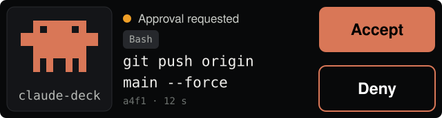
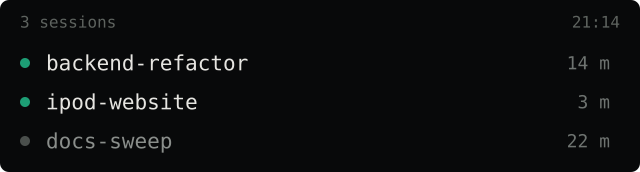
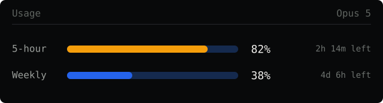

# claude-deck

**A small screen next to your keyboard that answers one question: may this agent do that?**



Claude Code asks before it does anything consequential — and that question always
lands in the terminal you just looked away from. This puts it somewhere else: a
3.5" touch display beside the keyboard shows the command, you tap **Accept** or
**Deny**, and the session carries on.

That is the whole idea. An ESP32-S3, a USB-C cable, a small Node daemon. The
device has no account, no network and nothing to sign in to — it shows what your
Mac sends it and sends `allow` or `deny` back.

---

## Start here

- **Brand-new board, or no board yet?** Start at step 1.
- **Board already flashed?** Skip to step 2 — it is one command.

### What you need

- A **Waveshare ESP32-S3-Touch-LCD-3.49, revision V2** (silkscreen `Rev1.1`, QC
  sticker `V2`). The V1 board looks identical and has a different pinout — with
  this firmware it boots and stays dark.
- A **USB-C data cable**. A charge-only one gives you a lit board and no serial
  port, which is a confusing half hour.
- A **Mac with Claude Code** and Node (`brew install node`).

### 1 · Put the firmware on the board

Plug the board in, then:

```bash
git clone https://github.com/justinp3r/claude-deck.git
cd claude-deck
brew install arduino-cli     # once per machine
./scripts/setup.sh           # ESP32 core, LVGL, ArduinoJson, lv_conf.h, ctags
./scripts/flash.sh           # compile and flash
```

No button to hold, nothing to erase first — `flash.sh` writes bootloader,
partition table and app over the factory demo in one go. The first build compiles
the whole ESP32 core and takes a few minutes; after that it is about 20 seconds.

You know it worked when the display starts cycling through its screens by itself.
That demo runs until the bridge checks in for the first time.

Port not showing up, display black, build failing? Every failure mode with its
cause is in [FLASHING.md](FLASHING.md).

### 2 · Connect it to Claude Code

```bash
./scripts/install.sh
```

Then restart Claude Code once. That is it.

Three things get set up, all reversible: the bridge starts as a background service
at login, a `PermissionRequest` hook is registered in `~/.claude/settings.json`,
and a statusline shim reads your usage limits and then calls your own statusline
unchanged. `settings.json` is backed up before it is touched.

Changed your mind: `./scripts/install.sh --uninstall` puts everything back.

### 3 · Try it

Start Claude Code in any project and ask it to do something it needs permission
for — writing a file outside the project, say. The request appears on the device.

Nothing arrives? Usually Claude Code is not asking at all, because the tool is
already covered by an allow rule or the session runs in bypass mode. The rest of
the checklist is in [CONNECTING.md](CONNECTING.md).

---

## What you see on it



When nothing needs deciding, the device shows which sessions are running and how
long each has been busy. If none are, Clawd walks across the screen — 13 seconds
from left to right, a pause off-screen, then round again. It is a screen you can
leave switched on.

When a request comes in, it takes over the display: the command in the middle,
**Accept** filled in Anthropic orange, **Deny** outlined below it. If more than
one session is waiting, a position bar appears and you page through them. Tapping
the tile opens the full command across the whole width, since real shell commands
are longer than the column.



Swipe down and you get your rate limits: the 5-hour window and the week, coloured
at the same thresholds Claude Code itself warns at — blue below 75%, orange from
75%, red from 95%.

There are no buttons anywhere in the interface. At 22.6 mm of screen height, every
control is space taken from the content, so it is all gestures:

| Gesture | What happens |
|---|---|
| swipe ↓ | usage view — in the session list, page back through it first |
| swipe ↑ | back where you came from |
| swipe ← → | page through the waiting requests |
| tap the tile | the full command; tap again to go back |

A swipe never counts as a tap, even when it starts on the Accept button.

<sub>The pictures above are drawn from the firmware's own layout — coordinates,
sizes and colours come straight out of `ui_theme.h`, `ui_panel.c` and `clawd.c`
via [`docs/render-panels.py`](docs/render-panels.py). They are not photographs.</sub>

---

## The rule everything hangs on

**Every failure path hands the question back to the terminal.** Cable unplugged,
bridge dead, timeout, malformed JSON: the hook returns no decision and the usual
dialog appears exactly as before. Measured:

| Case | Time until the terminal asks |
|---|---|
| Cable unplugged | 0.06 s |
| Bridge stopped | 0.06 s |
| Device present, nobody taps | 30 s (configurable) |

There is no path on which a silent device approves anything — not even from a
single noisy touch sample, because a tap only counts once two consecutive readings
confirm it.

## How it fits together

```
Claude Code                 Bridge (Node)              ESP32-S3
    │                            │                        │
    │ PermissionRequest hook     │                        │
    ├───────────────────────────►│  USB-C                 │
    │  (Unix socket)             ├───────────────────────►│  shows the request
    │                            │                        │
    │◄───────────────────────────┤◄───────────────────────┤  Accept / Deny
    │  allow / deny              │                        │
```

The daemon sits in the middle because only one process can hold a serial port open,
and you usually have several Claude Code sessions running — which is also how it
knows the queue. Neither the bridge nor the hook has a single npm dependency.

The link is the same USB-C cable that powers the device. No Bluetooth, no Wi-Fi, no
pairing, no credentials on the device. [CONNECTING.md](CONNECTING.md) explains why,
and what a wireless version would actually cost you.

## Where things live

```
firmware/claude_deck/   Arduino sketch: LVGL, the six screens, serial protocol
bridge/                 Node daemon, hook glue, self-test
scripts/                install.sh, setup.sh, flash.sh, bridge-service.sh
.claude/                hook registration for this project
docs/                   the panel images and the script that draws them
reference/              material this was built from, not part of the build
```

| Read next | For |
|---|---|
| [FLASHING.md](FLASHING.md) | building the firmware, trying it out, everything that can go wrong |
| [CONNECTING.md](CONNECTING.md) | setup, a second machine, why the cable |
| [CLAUDE.md](CLAUDE.md) | architecture, design decisions, every pitfall found along the way |

To check the whole chain end to end without touching the display:

```bash
./scripts/flash.sh -t          # firmware with the self-test switch
node bridge/selftest.mjs       # Accept, Deny and timeout
./scripts/flash.sh             # and back to normal firmware afterwards
```
